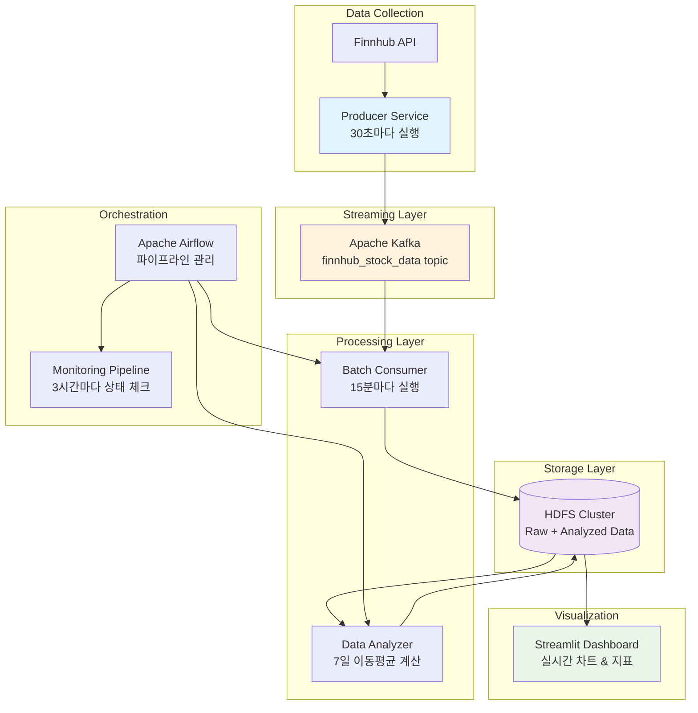

# 📈 실시간 주식 데이터 파이프라인

Apache Kafka, Spark, HDFS, Airflow를 활용한 완전한 실시간 데이터 파이프라인입니다. Finnhub API로부터 30초마다 주식 데이터를 수집하여, 7일 이동평균 등 투자 지표를 계산하고 웹 대시보드에서 실시간으로 확인할 수 있습니다.


## 🎯 프로젝트 개요

### 구현 배경
실시간 금융 데이터 분석에서 중요한 것은 **지연 시간 최소화**와 **안정적인 데이터 파이프라인**입니다. 기존 배치 처리만으로는 빠르게 변화하는 시장 상황을 놓칠 수 있어, 실시간 스트리밍과 배치 처리를 결합한 **람다 아키텍처**를 구현했습니다.

### 핵심 특징
- **🔄 실시간 수집**: Finnhub API에서 30초마다 주식 데이터 자동 수집
- **⚡ 스트림 처리**: Apache Kafka로 초당 수천 건의 메시지 처리 가능
- **🏗️ 분산 저장**: HDFS 클러스터 기반으로 확장 가능한 데이터 레이크 구축
- **📊 지능형 분석**: Spark로 7일 이동평균, 변동성 등 기술적 지표 자동 계산
- **📈 실시간 대시보드**: Streamlit 기반 인터랙티브 웹 대시보드
- **🔧 자동화**: Airflow로 전체 파이프라인 스케줄링 및 모니터링

## 🏗️ 시스템 아키텍처



## 🛠️ 기술 스택

### 데이터 수집 & 스트리밍
- **Apache Kafka**: 초당 수천 메시지 처리 가능한 분산 스트리밍 플랫폼
- **Zookeeper**: Kafka 클러스터 코디네이션 및 메타데이터 관리
- **Python Producer**: 안정적인 API 호출과 에러 핸들링

### 데이터 처리 & 분석  
- **Apache Spark 3.5**: 메모리 기반 분산 처리로 빠른 분석 성능
- **PySpark**: Python 기반 데이터 처리 및 분석
- **Spark SQL**: SQL 기반 대용량 데이터 집계 및 변환

### 데이터 저장
- **Hadoop HDFS 3.3**: 페타바이트급 확장 가능한 분산 파일 시스템
- **Apache Parquet**: 컬럼형 저장으로 분석 쿼리 성능 10배 향상

### 워크플로 관리
- **Apache Airflow 2.7**: DAG 기반 파이프라인 스케줄링
- **Docker Compose**: 마이크로서비스 아키텍처 컨테이너 오케스트레이션

### 시각화 & 모니터링
- **Streamlit**: Python 기반 인터랙티브 웹 대시보드
- **자체 모니터링**: Kafka 토픽 상태 및 HDFS 데이터 검증

## 🚀 빠른 시작

### 준비사항
1. **Docker Desktop** (4GB+ RAM 권장)
2. **Finnhub API 키** ([무료 가입](https://finnhub.io/))
3. **Git** (프로젝트 클론용)

### 1단계: 프로젝트 설정
```bash
# 프로젝트 클론
git clone <repository-url>
cd stock_market_data

# 환경 변수 설정
cp .env.example .env
# .env 파일에 API 키 입력
```

`.env` 파일 설정 예시:
```bash
# Finnhub API 설정
FINNHUB_API_KEY=your_api_key_here
STOCK_SYMBOLS=AAPL,MSFT,GOOGL,AMZN,TSLA,NVDA,META,NFLX
STOCK_SELECTION_METHOD=manual

# Airflow 설정
AIRFLOW__CORE__EXECUTOR=LocalExecutor
AIRFLOW__DATABASE__SQL_ALCHEMY_CONN=sqlite:////opt/airflow/airflow.db
AIRFLOW__CORE__FERNET_KEY=32자리_임의_키
AIRFLOW__WEBSERVER__SECRET_KEY=임의_시크릿_키
```

### 2단계: 시스템 실행
```bash
# 전체 시스템 시작 (첫 실행시 5-10분 소요)
docker-compose up -d --build

# 컨테이너 상태 확인
docker-compose ps

# 로그 확인 (문제 발생시)
docker-compose logs -f
```

### 3단계: 서비스 접속
| 서비스 | URL | 계정 |
|--------|-----|------|
| 🌐 **Streamlit 대시보드** | http://localhost:8503 | - |
| ✈️ **Airflow 웹** | http://localhost:8082 | admin/admin |
| ⚡ **Spark Master** | http://localhost:8080 | - |
| 🗂️ **HDFS NameNode** | http://localhost:9870 | - |

### 4단계: 데이터 파이프라인 실행
1. **Airflow 웹 UI** (http://localhost:8082) 접속
2. `finnhub_stock_pipeline` DAG 활성화 (토글 ON)
3. "Trigger DAG" 버튼 클릭하여 수동 실행
4. **대시보드** (http://localhost:8503)에서 결과 확인

## 📁 프로젝트 구조

```
stock_market_data/
├── 🐍 scripts/                     # 핵심 데이터 처리 스크립트
│   ├── finnhub_producer.py         # API 데이터 수집기 (30초마다)
│   ├── finnhub_consumer.py         # Kafka → HDFS 배치 처리
│   ├── finnhub_batch_analyzer.py   # 7일 이동평균 등 지표 계산
│   └── hdfs_init.sh               # HDFS 디렉토리 자동 초기화
├── ✈️ dags/                        # Airflow 워크플로 정의
│   ├── finnhub_pipeline.py         # 기본 파이프라인 (15분 간격)
│   ├── optimized_finnhub_pipeline.py  # 최적화 버전 (시장시간 체크)
│   └── monitoring_pipeline.py      # 시스템 상태 모니터링
├── 🧪 tests/                       # 테스트 코드
│   └── test_dag_integrity.py       # DAG 문법 검증
├── 📊 dashboard.py                 # Streamlit 웹 대시보드
├── 🐳 docker-compose.yml          # 전체 시스템 컨테이너 정의
├── 📋 requirements.txt            # Python 패키지 의존성
└── 📄 README.md                   # 프로젝트 문서 (현재 파일)
```

## 📊 주요 기능 상세

### 실시간 데이터 수집
- **수집 주기**: 30초마다 자동 실행
- **수집 종목**: 환경변수로 설정 가능 (기본: 8개 테크 주식)
- **데이터 종류**: 현재가, 시가/고가/저가, 시가총액, P/E비율, 베타 등 25개 컬럼
- **안정성**: API 레이트 제한 준수, 자동 재시도, 에러 핸들링

### 배치 데이터 분석
- **분석 주기**: 15분마다 Airflow에서 자동 실행
- **중복 제거**: 같은 종목/시간의 데이터 자동 중복 제거
- **기술적 지표**: 7일 이동평균, 일간 변동성, 가격 범위 등
- **증분 처리**: 이미 분석된 날짜는 재처리하지 않음

### 실시간 대시보드
- **인터랙티브 차트**: 가격 추이, 이동평균선, 재무지표 트렌드
- **주요 지표 카드**: 현재가, 시가총액, P/E비율, 변동성
- **다국어 지원**: 한국어 설명 및 원화 환산 표시
- **자동 새로고침**: 5분마다 데이터 캐시 갱신

## 🔧 고급 설정

### 모니터링 활성화
```bash
# Airflow에서 monitoring_pipeline DAG 활성화
# 3시간마다 시스템 상태 자동 체크
```

### 커스텀 종목 설정
```bash
# .env 파일에서 설정
STOCK_SYMBOLS=AAPL,TSLA,NVDA  # 원하는 종목 코드
STOCK_SELECTION_METHOD=manual  # manual/trending/sp500
```

### 성능 최적화
- **Spark 메모리 조정**: `docker-compose.yml`에서 메모리 설정 변경
- **수집 주기 조정**: `finnhub_producer.py`의 `REQUEST_INTERVAL_SECONDS` 변경
- **배치 주기 조정**: DAG 파일의 `schedule_interval` 변경

## 🐛 문제 해결

### 자주 발생하는 이슈

1. **컨테이너가 안 뜨는 경우**
```bash
# 메모리 부족일 가능성
docker system prune -a
docker-compose up -d
```

2. **API 키 오류**
```bash
# .env 파일 확인
cat .env | grep FINNHUB_API_KEY
```

3. **대시보드에 데이터가 안 보이는 경우**
```bash
# Airflow에서 DAG 실행 확인
# HDFS에 데이터 있는지 확인
docker exec namenode hdfs dfs -ls /user/spark/analyzed_finnhub_data
```

### 로그 확인
```bash
# 전체 로그
docker-compose logs -f

# 특정 서비스 로그
docker-compose logs -f spark-master
docker-compose logs -f kafka
docker-compose logs -f airflow-webserver
```

## 🎓 학습 포인트

이 프로젝트를 통해 학습할 수 있는 주요 개념들:

### 데이터 엔지니어링
- **람다 아키텍처**: 실시간 스트리밍 + 배치 처리 결합
- **분산 시스템**: Kafka, Spark, HDFS 클러스터 구성
- **데이터 파이프라인**: ETL/ELT 프로세스 설계 및 구현

### 빅데이터 기술
- **Apache Spark**: RDD, DataFrame, Structured Streaming
- **Apache Kafka**: Producer/Consumer, 토픽 파티셔닝
- **Hadoop HDFS**: 분산 파일 시스템, 데이터 복제

### 데브옵스
- **컨테이너화**: Docker, Docker Compose
- **워크플로 관리**: Apache Airflow DAG
- **모니터링**: 시스템 상태 추적 및 알림

## 📈 확장 가능성

### 추가 구현 가능한 기능
- **실시간 알림**: 가격 급변 시 슬랙/이메일 알림
- **머신러닝**: 주가 예측 모델 추가
- **다중 데이터소스**: Alpha Vantage, Yahoo Finance 등 추가
- **고급 분석**: 볼린저 밴드, RSI, MACD 등 기술적 지표
- **백테스팅**: 트레이딩 전략 검증 시스템

### 인프라 확장
- **Kubernetes**: 프로덕션 배포를 위한 컨테이너 오케스트레이션
- **Apache Flink**: 더 낮은 지연 시간의 스트림 처리
- **ClickHouse**: 실시간 분석을 위한 컬럼형 데이터베이스
- **Grafana**: 전문적인 모니터링 대시보드

---

**⭐ 이 프로젝트가 도움이 되셨다면 Star를 눌러주세요!**

더 자세한 내용이나 질문이 있으시면 Issues를 통해 문의해 주세요. 🚀